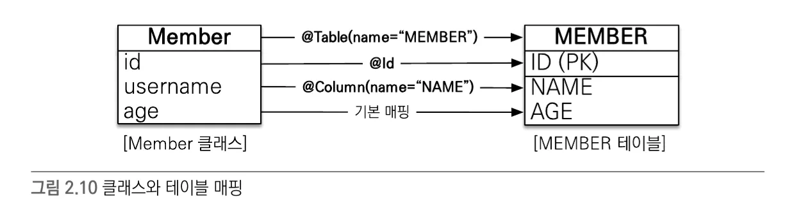
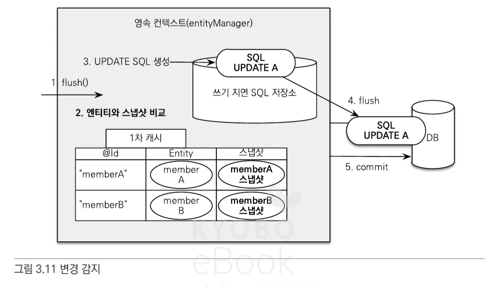
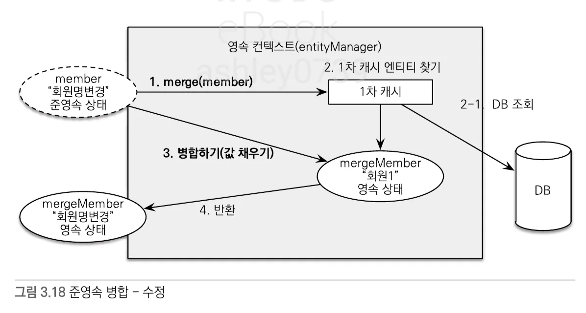
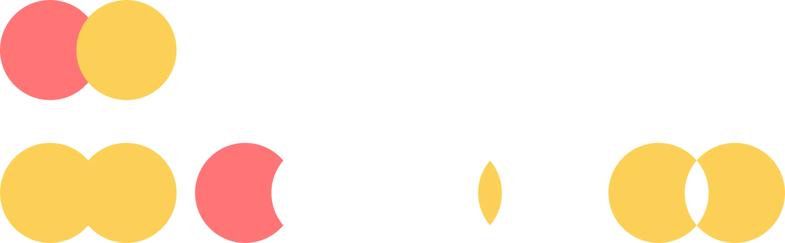

# 1️⃣일차 : 2025-01-13(MON)
<details>
  <summary>기획 준비</summary>

# 💡 비대면 면접 메이트

국내·외 기업의 취업 면접을 **비대면**으로 효율적으로 준비할 수 있는 서비스입니다.  
면접 스터디원 간 피드백을 간편하게 주고받을 수 있으며, **라이브 코딩 및 알고리즘** 문제 풀이 기능을 통해 **기술 면접**까지 대비할 수 있습니다.  

---

## 문제 상황

1. **국내 대기업 취업 준비 중인 지원자**  
   - 지방 거주로 인해 면접 스터디를 구하기 어려움  
   - 비대면 스터디 참여 시, 스터디원들이 대면 스터디에 비해 소극적이라고 느낌  
   - 스터디원 간 피드백 과정이 비효율적임

2. **해외 글로벌 IT 기업 취업 준비 중인 지원자**  
   - 영어로 자신의 생각을 명확히 표현하기 어려움  
   - 글로벌 면접에서 기대되는 태도와 답변 방식에 대한 정보 부족  
   - 라이브 코딩, 알고리즘 인터뷰에 대한 경험 부족  

---

## 핵심 기능

### 1. 비대면 면접 스터디
- **스터디 모집 및 매칭**  
  - 직무, 기술 스택, 경험 등 조건에 따라 그룹 생성  
- **피드백 관리**  
  - 채점 템플릿 제공: 스터디원들이 면접관 역할을 하며 객관적으로 평가  
  - 답변 텍스트화 & 코멘트 추가: 실시간 답변을 텍스트로 기록하고, 코멘트를 달아 피드백  
  - 피드백 취합 & 요약: AI가 여러 피드백을 자동으로 취합하여 개선점 요약  
- **영상 녹화 & 리뷰**  
  - 개인 면접 영상을 녹화 후, 비언어적 요소(표정, 시선, 제스처)까지 분석 가능  

### 2. 라이브 코딩 및 알고리즘 인터뷰 대비
- **Web IDE 제공**  
  - 온라인 상에서 알고리즘 문제(자료구조 구현, 알고리즘 풀이 등)를 연습  
- **풀이 과정 텍스트화**  
  - 풀이 과정 및 설명을 자동으로 텍스트화하여 시간대별 기록  
  - 자신의 논리 전개 흐름을 파악하고 피드백  
- **풀이 과정 설명 연습**  
  - 문제 해결 전략과 접근 방법을 연습할 수 있도록 가이드 제공  

### 3. 기출 질문 연습
- **질문당 답변 시간 측정**  
  - 면접과 유사한 환경에서 실전 감각 익히기  
- **AI 기반 답변 평가**  
  - 답변 논리성, 발음, 표현력 등 다각적인 분석  
- **답변 저장 & 비교**  
  - 이전 답변과 현재 답변을 비교하여 발전 상황 확인 가능  

---

## 유저 시나리오

### 국내 대기업 취업 준비 중인 지원자
1. **면접 대비 비대면 스터디 모집**  
   - “백엔드 개발자”, “Java/Spring Boot”, “신입/1년 경력” 조건으로 스터디 생성  
2. **스터디원들과 모의 면접 진행**  
   - 스터디원들이 돌아가며 면접관 및 지원자 역할을 수행  
   - 면접관 역할을 맡은 사람이 실시간으로 답변 텍스트화 및 코멘트 추가  
   - 면접 종료 후, AI가 스터디원 피드백을 종합하여 개선점 요약 (예: “말이 조금 빠르고, 논리적 흐름이 다소 부족함”)  
3. **면접 영상 리뷰**  
   - 녹화된 영상을 시청하며 표정, 시선 처리 등 비언어적 요소 확인  
   - AI 피드백을 통해 개선 포인트 파악 (예: “카메라 응시 빈도 낮음, 미소 부족”)  

### 해외 글로벌 IT 기업 취업 준비 중인 지원자
1. **비대면 면접 일정 확정**  
   - 글로벌 IT 기업에서 비대면 면접 일정 통보  
   - 영어 면접 대비를 위해 체계적 연습 필요  
2. **기출 질문 연습**  
   - “Tell me about yourself”, “Explain a complex project” 등 글로벌 기업 질문 연습  
   - AI 평가 및 피드백 예시  
     - 발음 명료성: 3/5 (발음을 천천히 하고, 강세 정확도 높이기)  
     - 답변 논리성: 4/5 (구체적 예시와 결과 추가 필요)  
   - 이전 답변과 비교해 점차 발전 과정을 추적  
3. **라이브 코딩 연습**  
   - Web IDE에서 “Two Sum”, “Binary Tree Traversal” 등 알고리즘 문제 풀이  
   - 풀이 과정 설명을 연습하며, 논리적 사고 흐름을 정리  
4. **최종 면접 대비**  
   - 기출 질문, 라이브 코딩 연습 결과와 AI 피드백을 토대로 보완  
   - 면접 당일, 자신감 있고 명확한 의사소통을 목표로 준비  

---
</details>

<details>
  <summary>JPA 복습 1일차 - JPA 기초 </summary>

### 객체 매핑

- 매핑 정보를 표시하는 어노테이션 사용
    - @Entity, @id, @Column
### persistence.xml

- JPA 설정 정보
- META-INF/persistence.xml 클래스 패스 경로에 있으면 별도의 설정 없이 JPA가 인식함
- 일반적으로 영속성 유닛 (persistence-unit)은 연결할 데이터베이스당 하나 등록

<aside>
➕ 스프링 부트 사용 시 application.yml 사용

</aside>

### 데이터베이스 방언

- 방언 (dialect) : SQL 표준을 지키지 않거나 특정 데이터베이스만의 고유한 기능
- 특정 데이터베이스에 의존적인 SQL은 데이터베이스 방언이 처리해 줌 → 데이터베이스가 변경되어도 애플리케이션 코드 변경없이 데이터베이스 방언만 교체하면 됨

## 엔티티 매니저 설정


1. 엔티티 매니저 팩토리 생성
    
    ```java
    import javax.persistence.*;
    
    EntityManagerFactory emf = Persistence.createEntityManagerFactory("jpabook");
    ```
    
    - persistence.xml의 설정 정보를 사용해서 엔티티 매니저 팩토리 생성
        - "jpabook"과 같은 이름을 기준으로 영속성 유닛 (persistence-unit) 찾아아서 엔티티 매니저 팩토리 생성
    - JPA를 동작시키기 위한 기반 객체 생성 + JPA 구현체에 따라서 데이터베이스 커넥션 풀도 생성 → 엔티티 매니저 팩토리 **생성 비용 아주 큼**
        - 애플리케이션 전체에서 한 번만 생성하고 공유해서 사용
2. 엔티티 매니저 생성
    
    ```java
    EntityManager em = emf.createEntityManager();
    ```
    
    - 엔티티 팩토리 매니저에서 엔티티 매니저 생성
    - JPA의 기능 대부분을 엔티티 매니저가 제공
        - 엔티티를 데이터베이스에 CRUD
        - 내부에 데이터소스(데이터베이스 커넥션)을 유지하면서 데이터베이스와 통신
    - 엔티티 매니저는 데이터베이스 커넥션과 밀접한 관계가 있으므로 스레드간에 공유하거나 재사용 하면 안됨
3. 종료
    - 사용이 끝난 엔티티 매니저는 반드시 종료
    - 엔티티 매니저 팩토리도 종료
    
    ```java
    em.close(); 
    emf.close();
    ```
    

## 트랜잭션 관리

- JPA를 사용하면 항상 트랜잭션 안에서 데이터를 변경해야함
    - 아니면 예외 발생

```java
EntityTransaction tx = em.getTransaction();     
try {
				tx.begin(); //트랜잭션 시작
        logic(em);  //비즈니스 로직
        tx.commit();//트랜잭션 커밋
} catch (Exception e) {
        tx.rollback(); //트랜잭션 롤백
}
```

## 비즈니스 로직

```java
public interface EntityManager {
    void persist(Object var1);
    
    void remove(Object var1);

    <T> T find(Class<T> var1, Object var2);
    
    ...
}
```

- **등록** `em.persist()`
- **수정** `JPA가 추적`
- **삭제** `em.remove()`
- **조회** `em.find()`
    - 검색 쿼리?
        - 테이블이 아닌 엔티티 객체를 대상을 검색하려면 데이터베이스의 모든 데이터를 애플리케이션으로 불러와서 엔티티 객체로 변경 후 검색해야함 → 불가능
        - 필요한 데이터만 데이터베이스에서 불러오려면 SQL 사용해야함 → JPQL 사용

## JPQL

- JPA가 제공하는 SQL을 추상화한 객체지향 쿼리 언어
- SQL 문법과 거의 유사
- SQL과의 차이점

| JPQL                                                          | SQL                                                     |
| ------------------------------------------------------------- | ------------------------------------------------------- |
| 엔티티 객체를 대상으로 쿼리함 (클래스와 필드를 대상으로 쿼리함)<br>데이터베이스 테이블 전혀 알지 못함 | 데이터베이스 테이블을 대상으로 쿼리함                 |
| 대소문자 명확히 구분함                                        | 관례상 대소문자를 구분하지 않고 사용하는 경우 많음     |

</details>


# 2️⃣일차 : 2025-01-14(TUE)
<details>
  <summary>JPA 복습 2일차 - 영속성 관리1</summary>

# 1. 엔티티 매니저 팩토리와 엔티티 매니저

### 엔티티 매니저 팩토리

- 생성 비용 큼
- 여러 스레드가 동시에 접근해도 안전하므로 서로 다른 스레드 간에 공유 가능
- 하이버네이트를 포함한 JPA 구현체들은 EntityManagerFactory 생성할 때 커넥션 풀 만듦 (J2SE환경)

### 엔티티 매니저

- 여러 스레드가 동시에 접근하면 동시성 문제 발생
- 데이터베이스 연결이 필요한 시점까지 커넥션을 얻지 않는다.
    - 보통 트랜잭션 시작할 때 커넥션 획득

# 2. 영속성 컨텍스트란?

### 영속성 컨텍스트(persistence context)

> 엔티티를 영구 저장하는 환경
> 
- 엔티티 매니저로 엔티티를 저장하거나 조회하면 엔티티 매니저는 영속성 컨텍스트에 엔티티를 보관하고 관리함
- 영속성 컨텍스트는 엔티티 매니저를 생성할 때 하나 만들어짐
- 엔티티 매니저를 통해 영속성 컨텍스트 접근, 관리 가능
- 여러 엔티티 매니저가 같은 영속성 컨텍스트에 접근할 수도 있다

# 3. 엔티티의 생명주기


### 엔티티의 상태

- **비영속(new/transient)** : 영속성 컨텍스트와 전혀 관계가 없는 상태
    - 객체 생성, 순수한 객체 상태
    - 영속성 컨텍스트나 데이터베이스와는 전형 관련 없음
- **영속(managed)** : 영속성 컨텍스트에 저장된 상태
    - 엔티티 매니저를 통해 저장(persist), 조회(find), JPQL 사용해서 조회한 엔티티
    - 영속성 컨텍스트에 의해 관리
- **준영속(detached)** : 영속성 컨텍스트에 저장되었다가 분리된 상태
    - 엔티티 매니저를 통해 detach, close, clear
    - 관리하던 영속 상태의 엔티티를 영속성 컨텍스트가 관리하지 않으면 준영속 상태가 됨
- **삭제(removed)** : 삭제된 상태
    - 엔티티를 영속성 컨텍스트와 데이터베이스에서 삭제

# 4. 영속성 컨텍스트의 특징

- 영속성 컨텍스트와 식별자 값
    - 영속성 컨텍스트는 엔티티를 식별자 값(@id)으로 구분
    - 영속 상태는 식별자 값이 반드시 존재
- 영속성 컨텍스트와 데이터베이스 저장
    - JPA는 보통 트랜잭션을 커밋하는 순간 영속성 컨텍스트에 새로 저장된 엔티티를 데이터베이스에 반영 (플러시)
- 영속성 컨텍스트가 엔티티를 관리할 때의 장점
    - 1차 캐시
    - 동일성 보장
    - 트랜잭션을 지원하는 쓰기 지연
    - 변경 감지
    - 지연 로딩

## 4.1 엔티티 조회

### 1차 캐시 `장점1`

- 영속성 컨텍스트 내부의 캐시
- 영속상태의 엔티티는 모두 1차 캐시에 저장됨
- Map<식별자 값, 엔티티 인스턴스> 형태로 저장한다고 생각하면 됨
- 식별자 값은 데이터베이스 기본 키와 매핑되어 있으므로 영속성 컨텍스트에서 데이터를 저장하고 조회하는 모든 기준은 데이터베이스 기본 키 값이다.
- **성능상 이점 보장**
    - 예시) em.find()
        1. **1차 캐시에서 엔티티 조회**
            1. 1차 캐시에 있으면 → 4
            2. 1차 캐시에 없으면 → 2
        2. 데이터베이스를 조회해서 엔티티를 생성
        3. 1차 캐시에 저장
        4. 영속 상태의 엔티티 반환

### 영속 엔티티의 동일성 보장 `장점2`

- 식별자가 같은 엔티티 인스턴스를 조회하면 1차 캐시에 있는 같은 엔티티 인스턴스를 조회하므로 `a == b` 는 참이다.

<aside>
➕ JPA는 1차 캐시를 통해 반복 가능한 읽기 (REPEATABLE READ) 등급의 트랜잭션 격리 수준을 데이터베이스가 아닌 애플리케이션 차원에서 제공한다는 장점이 있다

</aside>

## 4.2 엔티티 등록

### 트랜잭션을 지원하는 쓰기 지연(transactional write-behind) `장점3`

- 트랜잭션을 커밋하기 직전까지 내부 쿼리 저장소에 쿼리를 모아두었다가 커밋할 때 모아둔 쿼리를 데이터베이스에 보냄
- 트랜잭션을 커밋하면
    1. 엔티티 매니저는 우선 영속성 컨텍스트를 플러시한다
        - **플러시(flush) : 영속성 컨텍스트의 변경 내용을 데이터베이스에 동기화하는 작업**
        - 쓰기 지연 SQL 저장소에 모인 쿼리를 데이터베이스에 보낸다
    2. 실제 데이터 베이스 트랜잭션을 커밋함

    
- 트랜잭션을 지원하는 쓰기 지연 가능한 이유? : 데이터 베이스에 쿼리를 바로 전달해도 트랜잭션을 커밋하지 않으면 소용 없음. 즉 커밋 직전에만 데이터베이스에 SQL을 전달하면 됨
- 쓰기 지연 이용해서 성능 최적화 가능

## 4.3 엔티티 수정

### 변경 감지(dirty checking) `장점4`

> 엔티티의 변경사항을 데이터베이스에 자동으로 반영하는 기능
> 
- JPA는 엔티티를 영속성 컨텍스트에 보관할 때, 최초 상태를 복사해서 저장해둠 (**스냅샷**)
- 플러시 시점에 스냅샷과 엔티티를 비교해서 변경된 엔티티를 찾는다.
- 변경 감지 로직
    1. 트랜잭션을 커밋하면 엔티티 매니저 내부에서 플러시 호출
    2. 엔티티와 스냅샷을 비교해서 변경된 엔티티를 찾는다
    3. 변경된 엔티티가 있으며 수정 쿼리를 생성해서 쓰기 지연 SQL 저장소에 보낸다
    4. 쓰기 지연 저장소의 SQL을 데이터베이스에 보낸다
    5. 데이터베이스 트랜잭션 커밋
    
    
    
- 변경 감지는 영속성 컨텍스트가 관리하는 영속 상태의 엔티티에만 적용된다
- JPA의 기본 전략은 엔티티의 모든 필드 업데이트
    - 장점
        - 모든 필드를 사용하면 수정 쿼리가 항상 같으므로 애플리케이션 로딩 시점에 수정 쿼리를 미리 생성해두고 재사용 가능
        - 데이터베이스는 이전에 한 번 파싱된 쿼리 재사용 가능
    - 단점
        - 데이터베이스에 보내는 데이터 전송량이 증가
    - 필드가 많거나 저장되는 내용이 너무 크면 동적으로 UPDATE SQL 생성하는 전략 (`@DynamicUpdate`) 사용하면 됨

<aside>
➕ 상황에 따라 다르지만 컬럼이 대략 30개 이상 되면 정적 수정 쿼리보다 동적 수정 쿼리가 빠름

- 한 테이블에 컬럼이 30개 이상 된다는 것은 테이블 설계상 책임이 적절하게 분리되지 않았을 가능성이 높음
</aside>

## 4.3 엔티티 삭제

- 엔티티를 삭제하려면 1. 삭제 대상 엔티티 조회 2. em.remove()
- em.remove()를 호출하는 순간 엔티티는 영속성 컨텍스트에서 제거됨
- 삭제된 엔티티는 재사용하지말고 자연스럽게 가비지 컬렉션의 대상이 되도록 두는 것이 좋다
</details>

<details>
  <summary>[피그마 특강 1일차] 기억할만한 팁</summary>

  ## 1. 피그마 파일 Thumbnail 설정 방법
- **Frame**에서 우클릭 → `Set as thumbnail` 선택
- 해당 Frame이 파일의 Thumbnail로 설정됨, 반영되는 데 딜레이 있음

---

## 2. 댓글(Comment) 남기기
- **@멤버이름**으로 멤버를 지정하면 해당 멤버에게 알림 전송 가능
- **주의사항**: 멤버를 지정하지 않을 경우, **모든 멤버에게 이메일로 알림 전송**

## 3. 피그마 파일 옮기기
- `Drafts` ↔ `Project` 간 **드래그 앤 드롭**으로 파일 이동 가능
- 작업하면서 흐름 끊기지 않고 파일 이동시키고 싶으면? : 피그마 작업 화면에서 파일명 우측 드롭다운 클릭 -> move

## 4. 피그마 히스토리 기능
- 파일명 우측 드롭다운 -> Show version history
- history 버전으로 묶어두는 것 가능

</details>

# 3️⃣일차 : 2025-01-15(WED)

<details>
  <summary>JPA 복습 3일차 - 영속성 관리2</summary>

# 5. 플러시

> 영속성 컨텍스트의 변경 내용을 데이터베이스에 동기화하는 작업
> 

### 영속성 컨텍스트를 플러시하는 방법

- **em.flush() 직접 호출**
    - 엔티티 매니저의 flush() 메소드 직접 호출해서 영속성 컨텍스트를 강제 플러시
- **트랜잭션 커밋 시 플러시가 자동 호출**
    - 트랜잭션을 커밋하기 전에 꼭 플러시를 호출해서 영속성 컨텍스트의 변경 내용을 데이터베이스에 반영함
- **JPQL 쿼리 실행 시 플러시가 자동 호출**
    - JPQL은 SQL로 변환되어 데이터베이스에서 엔티티를 조회한다 → 영속성 컨텍스트의 변경 내용을 데이터베이스에 반영해야 JPQL이 정상적인 데이터 조회 가능

## 5.1 플러시 모드 옵션

- FlushModeType.AUTO : 커밋이나 쿼리를 실행할 때 플러시(기본값)
- FlushModeType.COMMIT : 커밋할 때만 플러시

# 6 준영속

## 6.1 엔티티를 준영속 상태로 전환 : detach()

- 특정 엔티티를 준영속 상태로 만듦
- ①1차 캐시부터 ② 쓰기 지연 SQL 저장소까지 해당 엔티티를 관리하기 위한 모든 정보 제거

## 6.2 영속성 컨텍스트 초기화 : clear()

- 영속성 컨텍스트를 초기화해서 해당 영속성 컨텍스트의 모든 엔티티를 준영속 상태로 만듦
- 영속성 컨텍스트를 제거하고 새로 만든 것과 같음

## 6.3 영속성 컨텍스트 종료 : close()

- 영속성 컨텍스트를 종료하면 해당 영속성 컨텍스트의 모든 엔티티는 준영속 상태가 됨
- 주로 영속성 컨텍스트가 종료되면서 준영속 상태가 되는 경우가 많음

## 6.4 준영속 상태의 특징

### 거의 비영속 상태에 가깝다

- 1차 캐시, 쓰기 지연, 변경 감지, 지연 로딩을 포함한 영속성 컨텍스트가 제공하는 어떠한 기능도 동작하지 않음

### 식별자 값을 가지고 있다

- 이미 한 번 영속 상태였으므로 반드시 식별자 값을 가지고 있음

### 지연로딩을 할 수 없다

- LAZY LOADING : 실제 객체 대신 프록시 객체를 로딩해두고 해당 객체를 실제 사용할 때 영속성 컨텍스트를 통해 데이터를 불러오는 방법
- 지연 로딩 시 문제 발생

## 6.5 병합: merge()

### 준영속 병합

- 준영속 상태 → 영속 상태
- 새로운 영속 상태의 엔티티 반환
    - merge에 넘겨준 엔티티가 준영속 상태에서 영속 상태로 변경되는 것은 아니고 새로운 영속 상태의 엔티티를 반환하는 것임
- merge() 로직
    1. 파라미터로 넘어온 준영속 엔티티의 식별자 값으로 1차 캐시에서 엔티티를 조회
        
        2-1 만약 1차 캐시에 엔티티가 없으면 데이터베이스에서 엔티티를 조회하고 1차 캐시에 저장
        
    2. 조회한 영속 엔티티에 파라미터로 넘어온 준영속 엔티티의 값을 채워 넣음
    3. 영속 엔티티 반환
    
    
    
- 준영속 엔티티를 참조하던 변수를 영속 엔티티를 참조하도록 변경하는 것이 안전
    
    ```java
    memebr = em2.merge(member)
    ```
    

### 비영속 병합

- 비영속 상태 → 영속 상태
- merge() 로직
    1. 파라미터로 넘어온 준영속 엔티티의 식별자 값으로 1차 캐시에서 엔티티를 조회
        
        2-1 만약 1차 캐시에 엔티티가 없으면 데이터베이스에서 엔티티를 조회 → 엔티티 발견 못함, , 새로운 엔티티 생성
        
    2. 조회한 영속 엔티티에 파라미터로 넘어온 준영속 엔티티의 값을 채워 넣음
    3. 영속 엔티티 반환

<aside>
💡 persist(), merge() 둘 다 비영속 → 영속 가능한데 왜 persist()를 쓰는가?

- inserting 할 때 persist가 더 효율적. 불필요한 select문 안씀
- 원본 객체 복사 안함
- merge()보다 문법적 실수 가능성 낮음

</aside>


</details>

<details>
  <summary>[피그마 특강 2일차] 툴킷 기능, 와이어프레임과 UI레이아웃 디자인 </summary>

## 🛠️ **1. 툴킷 기능**
- `ready for dev` 
  - 디자인 완료 후 개발 시작 가능하다는 표시.

- `auto layout`
  - 자동 레이아웃을 잘 설정하면 코드 값이 잘 나옴.

- `annotate`
  - 줄자 기능: 간격을 마킹할 때 사용.  
  - 장점: dev 모드에서 표시한 것이 dev 모드를 벗어나면 보이지 않음.

- 단축키
  - `Shift + 1` → 전체 보기.
  - `Shift + 2` → 선택한 요소 꽉 차게 보기.
  - `Shift + Ctrl + O` → 레이어 아웃라인 보기.

---

## 🖼️ **2. 프레임의 역할**
- 프레임은 **틀** 역할로 모든 요소를 담는 **컨테이너** 역할을 함.
  - 화면 크기 지정: 모바일/웹 등 화면의 크기를 지정할 때 프레임 사용.
  - 기능 동작: 레이아웃 그리드, 오토 레이아웃, 프로토타이핑 등은 프레임에서만 동작.

- 프레임의 종류
  - **최상위 프레임 (Top-level Frame)**  
    - 프로토타이핑의 화면 단위로 사용됨.
  - **네스티드 프레임 (Nested Frame)**  
    - 프레임 안에 또 다른 프레임으로 구성.
    - 부모, 자식, 형제 관계로 관리 가능.

- 그룹과의 차이점
  - 프레임은 추가 기능(레이아웃 그리드, 오토 레이아웃 등)이 동작.
  - 그룹은 단순히 요소를 묶는 기능만 제공.

---

## 📏 **3. 디지털 화면 단위와 개념**
- dp(밀도 독립 픽셀)의 등장 배경
  - 디스플레이 발전으로 물리적 공간에 더 많은 픽셀을 넣을 수 있게 됨.
  - 동일한 1픽셀이라도 디바이스에 따라 크기 차이가 발생.

- DPI (Dot Per Inch)
  - 1인치에 들어가는 픽셀 수를 나타내는 단위.

---

## 🎨 **4. 아이콘 제작**
- Boolean 연산 (Union, Subtract, Intersect, Exclude)
  - 다양한 도형을 결합/제거하는 방법.
  
- Union vs. Group
  - 🔗 Union
    - 여러 도형을 하나의 벡터로 결합.
    - 개별 도형의 편집은 제한되지만, 크기 조정 시 품질 유지.
  - 🔳 Group
    - 도형을 묶어 정렬/이동 시 편리.
    - 개별 도형 수정 가능.

---

## 🧑‍🎨 **5. 디자인 감각 키우기**
- 여러 앱 설치 후 Figma로 레이아웃 따라 만들어보기.
- 디자인을 분석하고 비슷하게 재현하는 연습.

---

## 🖌️ **6. Figma 아이콘 관련 팁**
- 멀티플레이어 커서 
  - `View → Multiplayer Cursors`에서 끄고 켜기 가능.

- 아이콘 다운로드
  - [Google Fonts Icons](https://fonts.google.com/icons)에서 활용 가능.

---
</details>


# 4️⃣일차 : 2025-01-16(THU)

<details>
  <summary>JPA 복습 4일차 - 엔티티 매핑 </summary>

  # 1. @Entity

- JPA를 사용해서 테이블과 매핑할 클래스 지정
- name을 설정하지 않으면 클래스 이름 그대로 사용
- @Entity 적용 시 주의 사항
    - 기본 생성자는 필수(파라미터가 없는 public 또는 protected 생성자)
        - JPA가 엔티티 객체 생성할 때 사용함
    - final 클래스, enum, interface, inner 클래스에는 사용할 수 없다
    - 저장할 필드에 final을 사용하면 안된다.

# 2. @Table

- 엔티티와 매핑할 테이블 지정
- @Table 어노테이션 생략 시 엔티티 이름을 테이블 이름으로 사용

# 3. 다양한 매핑 사용

- @Enumerated : enum 타입 매핑
- @Temporal : 날짜 타입 매핑
- @Lob : CLOB, BLOB 타입 매핑

# 4. 데이터베이스 스키마 자동 생성

- JPA는 매핑 정보와 데이터베이스 방언을 사용해서  데이터베이스 스키마 자동으로 생성하는 기능 지원
- persistence.xml에 스키마 자동 생성 속성 추가
    
    ```xml
    <property name="hibernate.hbm2ddl.auto" value="create"/>
    ```
    
    | 옵션 | 설명 |
    | --- | --- |
    | create | 기존 테이블 삭제하고 새로 생성 `DROP + CREATE` |
    | create-drop | create 속성에 추가로 애플리케이션을 종료할 때 생성한 DDL 제거 `DROP + CREATE + DROP` |
    | update | 데이터베이스 테이블과 엔티티 매핑정보를 비교해서 변경 사항만 수정 |
    | validate | 데이터베이스 테이블과 엔티티 매핑정보를 비교해서 차이가 있으면 경고를 남기고 애플리케이션을 실행하지 않는다. `DDL 수정 안함` |
    | none | 자동 생성 기능을 사용하지 않으려면 1. hibernate.hbm2ddl.auto 속성 자체를 삭제 2. 유효하지 않은 옵션 값을 줌 ex) none |
- 애플리케이션 실행 시점에 데이터베이스 테이블을 자동으로 생성
- 자동 생성되는 DDL은 지정한 데이터베이스 방언에 따라 달라진다.
- 스키마 자동 생성 기능이 만든 DDL이 운영환경에 사용할만큼 완벽하지 않으므로 개발 환경에서 사용하거나 매핑 참고 용으로만 권장

> **💡 개발 환경에 따른 스키마 자동생성 추천 전략**
>
> - **개발 초기 단계**: `create` 또는 `update`
> - **초기화 상태로 자동화된 테스트를 진행하는 개발자 환경과 CI 서버**: `create` 또는 `create-drop`
> - **테스트 서버**: `update` 또는 `validate`
> - **스테이징과 운영 서버**: `validate` 또는 `none`

---

> **⚠️ 주의: `update`, `validate`는 JPA 표준에 없음**
>
> - JPA 표준 지원 옵션:  
>   `none`, `create`, `drop-and-create`, `drop`

---

> **🛠️ 이름 매핑 전략 변경하기**
>
> - 자바 Camel Case ↔ 데이터베이스 Snake Case
> - `@Column.name` 속성을 명시적으로 사용해서 이름 변경
> - `hibernate.ejb.naming_strategy` 속성을 사용해 이름 매핑 전략 변경
>
>   ```xml
>   <property name="hibernate.ejb.naming_strategy" value="org.hibernate.cfg.ImprovedNamingStrategy"/>
>   ```


# 5. DDL 생성 기능

- 매핑 정보에 nullable, length와 같은 속성 값을 주어 DDL에 제약 조건을 추가할 수 있다
    
    ```java
    @Column(name = "NAME", nullable = false, length = 10)
    private String name;
    ```
    
- DDL 제약 조건 관련 기능들은 단지 DDL을 자동 생성할 때만 사용되는 것이기 때문에 JPA 실행 로직에 영향을 미치지 않음
    - 따라서 스키마 자동 생성 기능을 사용하지 않고 직접 DDL을 만든다면 굳이 사용할 이유가 없다.
    
    → 그럼에도 사용한다면 조금의 장점 : 애플리케이션 개발자가 엔티티만 보고도 손쉽게 다양한 제약 조건을 파악할 수 있다.
</details>

<details>
  <summary>[피그마 특강 3일차] 프로토타입 & 프로토타이핑, GUI디자인 & UI Kit </summary>
  
  ## 1. 모바일 앱 OS

- **안드로이드 OS와 iOS 모두를 고려한 디자인 필요성**
  - 중립적 UI 특징
  - OS 독립성 및 일관된 사용성 보장
  - 사용자가 쉽게 적응할 수 있는 디자인 고려
  - **예시**: 쿠팡

---

## 2. 머티리얼 디자인

- **구글에서 제공하는 디자인 가이드라인**
  - 최근 UI/UX 트렌드를 리드
  - 참고 링크: [머티리얼 디자인 공식 사이트](https://m3.material.io/)

- **머티리얼 디자인의 기본 원칙**
  1. **자재질 (Material)**: 현실 세계에서 느낄 수 있는 물리적 자재질감을 표현
  2. **깊이 (Elevation)**: 레이어를 통해 깊이를 제공하여 시각적 위계를 명확히
  3. **움직임과 애니메이션 (Motion)**: 사용자의 주의를 끌고 상호작용을 부드럽게 연결

---

## 3. HIG (Human Interface Guidelines)

- **iOS 디자인 가이드라인**
  - Apple에서 제공하는 공식 문서
  - 앱에 반영된 디자인이 먼저 나오고, 이후 가이드라인으로 정리
  - 참고 링크: [HIG 공식 사이트](https://developer.apple.com/design/)

---

## 4. 디자인 시스템

- **정의**
  - 웹/모바일 인터페이스 디자인 시 반복적으로 사용되는 컴포넌트와 리소스를 체계화한 가이드라인
  - **구성 요소**
    - 컬러, 텍스트 스타일, 레이아웃, UI 구성 요소 등
  - 목적: 모든 디지털 제품에서 일관된 디자인과 효율적인 개발 지원

- **작은 프로젝트의 경우**
  - 디자인 시스템보다 **UI Kit** 활용 권장
  - **디자인 시스템과 UI Kit의 차이**
    - 디자인 시스템은 가이드라인과 철학을 포함한 포괄적인 개념
    - UI Kit은 재사용 가능한 컴포넌트 및 리소스에 초점

- **유용한 자료**
  - [오픈 디자인 시스템](https://www.designsystems.com/open-design-systems/)
  - 피그마 디자인 시스템 템플릿 참고 가능
  - **주의**: 템플릿 공유 시 저작권 문제 확인 필요

---

## 5. 프로토타입과 프로토타이핑

- **프로토타입 (Prototype)**
  - 정적인 레이아웃
  - 인터페이스와 화면 간의 이동 흐름만 보여줌

- **프로토타이핑 (Prototyping)**
  - 동적 동작 및 조작에 따른 피드백 포함
  - 실제 앱 작동 흐름을 시뮬레이션 가능

- **활용 장점**
  - 사용자 경험 개선
  - 개발자 및 디자이너 간의 커뮤니케이션 원활화
  - 개발 전 문제점 사전 발견 가능

---


</details>

# 5️⃣일차 : 2025-01-17(FRI)
<details>
  <summary>JPA 복습 5일차 - 연관관계 매핑 기초</summary>

  # 1. 단방향 연관관계

## 객체 연관관계 VS 테이블 연관관계

| 객체 연관관계 | 테이블 연관관계 |
| --- | --- |
| 참조로 연관관계 맺음 | 외래키로 연관관계 맺음 |
| 단방향 → 단방향 연관관계 2개로 양방향 참조 가능 | 양방향 |
| 연관된 데이터 조회 시 참조 사용 (객체 그래프 탐색) | 연관된 데이터 조회 시 조인 사용 |
- 객체 간의 연관관계를 양방향으로 만드려면 반대쪽에도 필드를 추가해서 참조를 보관해야한다. 양쪽에서 서로 참조가 가능해지나 양방향 관계가 아니라 서로 다른 단방향 관계 2개임을 유의

## 객체 관계 매핑

```java
@ManyToOne
@JoinColumn(name = "TEAM_ID")
private Team team
```

### @ManyToOne

- 다대일 관계에서 사용

### @JoinColumn

- 외래키 매핑 시 사용
- 생략하면 기본전략 사용
    - 기본 전략 : 필드명+_+참조하는 테이블의 컬럼명  ex) team_TEAM_ID

# 2. 연관관계 사용

## 2.1. 저장

> **❗ JPA에서 엔티티를 저장할 때 주의사항**
> 
> - 연관된 모든 엔티티는 **영속 상태**여야 합니다.

## 2.2. 조회

### 연관관계가 있는 엔티티를 조회하는 방법

1. 객체 그래프 탐색 (객체 연관관계를 사용한 조회)
    
    ex) `member.getTeam();`
    
2. 객체지향 쿼리 사용(JPQL)
    
    ex) 팀1에 소속된 회원 조회 `“select m from Member m join m.team t where t.name=:teamName”`
    
    → SQL 보다 간결
    

## 2.3. 수정

- 연관관계 수정도 변경 감지 기능 작동해서 자동 반영됨

## 2.4. 연관관계 제거

- 수정과 동일

## 2.5. 연관된 엔티티 삭제

- 기존에 있던 연관관계를 먼저 제거하고 삭제해야 한다.
- 연관관계가 남아 있으면 외래키 제약조건으로 인해 데이터베이스에 오류 발생

# 3. 양방향 연관관계

## 객체 연관관계

- 다대일 관계 + 일대다 관계
    
    ### 일대다 관계
    
    - @OneToMany(mappedBy = [반대쪽 매핑의 필드 이름])
    - 일대다 관계는 여러 건과 연관관계를 맺을 수 있으므로 컬렉션 사용

> **➕ JPA는 다양한 컬렉션을 지원합니다.**
> 
> - `List`, `Set`, `Map`을 포함한 다양한 컬렉션 타입을 사용할 수 있습니다.

## 테이블 연관관계

- 외래 키 하나로 양방향 조회 가능하므로 데이터베이스에 추가할 내용 없음

# 4. 연관관계의 주인

- 엔티티를 양방향 연관관계로 설정하면 객체의 참조는 둘인데 외래키는 하나인 상황 발생

→ 양방향 연관관계 매핑 시 두 연관관계 중 하나를 연관관계의 주인으로 정해야 함

| 연관관계의 주인 | 연관관계의 주인 X |
| --- | --- |
| 데이터베이스 연관관계와 매핑 | 데이터베이스 연관관계와 매핑 X |
| 외래키를 관리(등록, 수정, 삭제)할 수 있음 | 외래키 변경 불가, 읽기만 가능 |
| mappedBy 속성 사용 X | mappedBy 속성 사용해서 속성 값으로 연관관계의 주인 지정 |

> **➕ 다대일, 일대다 관계에서는 항상 다 쪽이 외래 키를 가집니다.**
> 
> - 따라서 `@ManyToOne`에는 `mappedBy` 속성이 없습니다.

# 5~6. 양방향 연관관계 저장 및 주의점

- 주인이 아닌 곳에 입력된 값은 외래키에 영향을 주지 않기 때문에 값을 설정하지 않아도 데이터베이스에 정상 입력됨
- 연관관계의 주인에는 값을 입력하지 않고 주인이 아닌 곳에만 값을 입력하는 것 유의하기
- 주인에만 값 저장하면 되지 않나?
    - JPA를 사용하지 않는 순수한 객체 상태에서 심각한 문제가 발생할 수 있기 때문에 양쪽 방향에 모두 값을 입력하는 것이 가장 안전함
- 실수 없이 양방향 관계 설정하기 위해 연관관계 편의 메소드 사용하기
    - 연관관계 편의 메소드
        
        > 한 번에 양방향 연관관계를 설정하는 메소드
        > 
- 연관관계 편의 메소드 주의사항 : 연관관계 변경 시 기존 관계 제거하기
    - 기존 관계를 제거하지 않으면 영속성 컨텍스트에서 삭제되지 않은 관계까지 조회할 수도 있음 → 새로운 영속성 컨텍스트에서 조회하면 데이터베이스에서 정보를 가져오므로 괜찮음


# 7. 정리

- 단방향 매핑에 비해 양방향 매핑은 복잡하다
    - 연관관계의 주인 설정
    - 두 개의 단방향 연관관계를 양방향을 만들기 위한 로직 관리
- 양방향의 장점은 반대방향으로 객체 그래프 탐색 기능이 추가된 것 뿐임
- 단방향 매핑만으로 테이블과 객체의 연관관계 매핑은 이미 완료되었기 때문에 우선 단방향 매핑을 사용하고 반대 방향으로 객체 그래프 탐색 기능(JPQL 쿼리 탐색 포함)이 필요할 때 양방향 사용하도록 코드 추가하기

> **❗ 양방향 매핑 시에 무한 루프에 빠지지 않게 조심하기**
> 
> 예시:
> - `Member.toString()`에서 `getTeam()` 호출
> - `Team.toString()`에서 `getMember()` 호출
> 
> 이와 같은 경우, 양쪽 객체 간 순환 호출로 인해 무한 루프가 발생할 수 있습니다.
</details>

