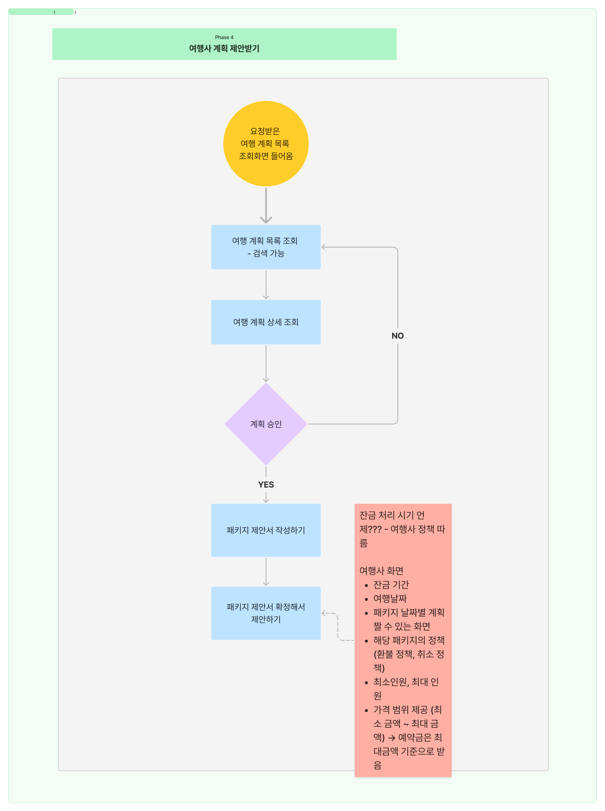

# 1️⃣일차 : 2025-01-13(MON)

  
초기 기획안 목록

| **번호** | **아이디어**    | **기획배경**                                                                                                 | **주요기능**                                                                                           |
|----------|----------------|-------------------------------------------------------------------------------------------------------------|-------------------------------------------------------------------------------------------------------------|
| 1️⃣      | 여행 플래너     | - 해외 여행을 처음 가는 사람 - 여행 계획을 짜는 데 어려움이 있는 사람 - 혼자 여행을 가기 싫은 사람  많은 사람들이 여행사의 패키지 상품을 이용하지만, 단점으로는 빡빡한 스케줄, 원치 않는 루트, 같은 패키지를 이용하는 일행 등이 있음. 여행을 가고 싶지만 가기 쉽지 않은 사람들을 위해 설계된 서비스. | - 🧑‍🤝‍🧑 **매칭**: 사용자가 원하는 여행 스타일 입력받아 유사한 회원끼리 매칭. 실시간 채팅/화상 통화로 여행 계획 작성 및 템플릿 제공. - 🔍 **기존 패키지 비교**: 여행사 API 활용하여 패키지 비교 기능 제공 (불가능 시 웹 크롤링). - 💬 **커뮤니티 / 피드백**: 후기 공유 및 피드백 제공. - ✈️ **현지 여행사 승인 시스템**: 작성된 일정에 대한 현지 여행사 승인 및 실시간 조정. 예약 및 일정 관리 기능. - 🔔 **알림 시스템**: 진행 상황 알림 제공. |
| 2️⃣      | 비대면 면접     | - 국내 대기업 취업 준비 중인 지원자  &nbsp;&nbsp;↳ 지방 거주로 면접 스터디 구하기 어려움  &nbsp;&nbsp;↳ 비대면 스터디에서 적극성 부족 및 비효율적인 피드백 과정 - 해외 글로벌 IT 기업 취업 준비 중인 지원자  &nbsp;&nbsp;↳ 영어로 생각을 명확히 표현하는 데 어려움  &nbsp;&nbsp;↳ 글로벌 면접 태도와 답변 방식 정보 부족  &nbsp;&nbsp;↳ 라이브 코딩, 알고리즘 인터뷰 미숙 | - 👥 **비대면 면접 스터디**  &nbsp;&nbsp;↳ 스터디 모집 및 매칭: 직무, 기술 스택, 경험 조건 기반 그룹 생성  &nbsp;&nbsp;↳ 피드백 관리: 채점 템플릿 제공, 답변 텍스트화, 코멘트 추가 및 요약  &nbsp;&nbsp;↳ 개인 면접 영상 녹화 및 리뷰 - 💻 **라이브 코딩 및 알고리즘 인터뷰 대비**  &nbsp;&nbsp;↳ WebIDE 제공, 자료구조 및 알고리즘 연습 환경 제공  &nbsp;&nbsp;↳ 텍스트화된 답변으로 스스로 피드백 가능 - 🧠 **기출 질문 연습**  &nbsp;&nbsp;↳ 질문당 답변 시간 측정  &nbsp;&nbsp;↳ AI 기반 답변 평가  &nbsp;&nbsp;↳ 답변 저장 및 비교로 발전 과정 확인 가능 |
| 3️⃣      | 원데이클래스    | - 1인 가구 증가로 인한 고립감 해소 필요  &nbsp;&nbsp;↳ 혼자 요리하거나 새로운 기술을 배우는 과정에서 느끼는 외로움 - 요리 초보자 및 특정 기술 초보자들의 어려움  &nbsp;&nbsp;↳ 실시간 피드백 부족으로 인한 학습 효율 저하 | - 🖥️ **실시간 화상 클래스**: 강사와 수강생을 연결하여 실시간 수업 진행  &nbsp;&nbsp;↳ 출석 확인, 실시간 퀴즈 및 설문조사 기능 제공 - 🔍 **강의 검색 및 추천**: 카테고리별 강의 검색 및 수강생 분석을 통한 맞춤 강의 추천 - 🎥 **강의 다시보기**: 수업 녹화 및 후속 질의응답 게시판 제공 - 🍳 **요리 세션 관리**: 레시피 공유, 단계별 진행 상황 체크, 실시간 피드백 제공 |
| 4️⃣      | 아파트 커뮤니티  | - 1인 가구 증가와 지역 간 소통 부족 문제 해결  &nbsp;&nbsp;↳ 입주민 간의 정보 공유 및 문제 해결 지원  &nbsp;&nbsp;↳ 아파트 관리 효율성 증대 | - 📢 **공지알림**: 관리자가 전체 공지 작성 및 모든 입주민에게 푸시 알림 발송 - 🛒 **커뮤니티 기능**: 중고거래, 자유게시판, 분실물게시판 등 게시판 기능  &nbsp;&nbsp;↳ 거주 인증된 사용자 간 안전한 거래 및 후기 작성 가능 - 🏠 **생활불편신고**: 층간소음, 주차 문제 등 신고 기능  &nbsp;&nbsp;↳ 관리자와의 직접 소통 및 중재 지원 - 🤝 **아파트 메이트 매칭**: 비슷한 관심사를 가진 입주민 연결 - 📅 **관리자 스케줄 관리**: 점검 일정 등 아파트 관리 일정을 한눈에 확인 가능 |
| 5️⃣      | 방탈출          | - 방탈출 카페를 가고 싶지만 코딩 시험 준비로 바쁜 사용자를 위한 서비스  &nbsp;&nbsp;↳ 방탈출을 코딩 문제와 결합하여 학습과 재미를 동시에 제공 | - 🕵️ **실시간 방탈출 게임**: 실시간 화상 통화로 방탈출 진행  &nbsp;&nbsp;↳ 사용자가 테마를 골라 문제 해결 - 🧩 **코딩 문제 결합**: 방탈출 문제를 코딩 문제로 변환  &nbsp;&nbsp;↳ 게임 진행 상황 알림: 진행률, 힌트, 제한 시간 등 제공 |
| 6️⃣      | 종토방          | - 종목 토론방의 비효율적 소통 문제 해결  &nbsp;&nbsp;↳ 실시간 소통과 비주주로 인한 신뢰 문제 보완 | - 💬 **실시간 채팅 및 화상 회의**: 종목에 대한 실시간 토론 및 의견 교환 - 📈 **실시간 캔들 차트 제공**: 채팅과 차트를 동시 제공하여 논의 시각화 - 🛡️ **주주 인증 및 평단가 표시**: 주주 인증을 통해 신뢰성 확보 및 개인화된 정보 제공 - 🌐 **WebRTC 및 Koscom API 활용**: 실시간 채팅과 캔들 차트 구현 - 🔗 **증권사 오픈 API 연동**: 주주 인증 및 평단가 데이터 확보 |

  
기획안 구체화를 위한 브레인스토밍

| **번호** | **아이디어**    | **브레인스토밍**                                                                                           |
|----------|----------------|-------------------------------------------------------------------------------------------------------------|
| 1️⃣      | 여행 플래너     |  |
| 2️⃣      | 비대면 면접     ||
| 3️⃣      | 원데이클래스    ||
| 4️⃣      | 아파트 커뮤니티  | |
| 5️⃣      | 방탈출          | |
| 6️⃣      | 종토방          | |

  
아이디어 우선순위 매트릭스

  

  
📌 1차 기획 피드백

| **번호** | **아이디어**    | **피드백**                                                                                           |
|----------|----------------|-------------------------------------------------------------------------------------------------------------|
| 1️⃣      | 여행 플래너     | 여행 스케줄 만드는 프로젝트는 많이 있었음 굳이 화상 회의일 필요가 있을까 싶음? 여행 계획을 하는 인원과 다 모이는 인원은 다름 사용자가 하는 일이 많음 경매 구현 어려움(프론트, 백엔드 단 둘 다…) UI제공, 편의 기능 제공할 것이 많기 때문에 할 일이 많음 위화감을 느끼는 부분 여행사가 조인을 할까? 여행사가 해외 여행이 싼 이유가 있음 → 전세기! 전세기에 맞춰서 인원을 뽑아두기 때문에 여행이 싼 것임 비행 일정이 들어가면 쉽지 않을 것 여행사에도 돈이 되어야 함. 여행사에게 최소한의 제약 조건을 걸어서 손실을 최소화 시켜야 함. 항공편 검색 기능을 추가하는 것도 좋은 방법. 지금까지는 없던 아이디어다! 스케일이 크다. 해볼 건 많음 step 3과 step 4 부분의 구체적인 뒷 받침 근거가 더 필요할 것으로 보임. 이를 통해 step 5를 더 구체화? 할 필요도 있을 것. AI 스캐줄러를 더 고도화해서 사용해보면 좋지 않을까 - 퍼플렉시티? 프론트엔드 단에서 난이도가 높음. 물론 백엔드도 높음. 아무튼 높음. 챗봇 질의응답 등등 아무 AI 기술들을 많이 넣는 게 좋을 것 같다. 해외 장소 데이터의 접근성이 낮다. 국내, 국외를 딱 정해서 하는게 좋다. |
| 2️⃣      | 비대면 면접     | 한 100팀 정도 나온 아이디어 면접의 질문과 답변 섹션 나누고 ai 분석함. 백화사전처럼 카테고리화하여 검색할 수 있게 함. 앞으로 살을 붙이면서 우리만의 색깔이 있다면 뭐……. |
| 3️⃣      | 원데이클래스    | 쓰레기 통 행………………………….  뭐든 할 수 있는 건 별로 추천 안 함 범용적으로 나와있는 서비스는 많기 때문에 차별화하려면 특화해서 제한을 두고 해당 분야에서만 필요로 하는 기능 추가하기 |
| 4️⃣      | 아파트 커뮤니티  | 활성화가 잘 안됨 요즘은 내 근처에 누가 사는지 알고 싶지 않아 함 신도시, 아이가 있는 가정은 가능할지도..? 포인트제를 하는 것이 좋을 수도 안좋을 수도 있음. 활성화되어있는 상태라면 좋지 않을까?정도 |
| 5️⃣      | 방탈출          | 게임한다고 평가 안좋은거 아님 html로만 화면 구성해도 상관 X 어떤 문제를 내서 어떻게 책정? 방을 대체 몇 개를 만들어야 함? 너무 노가다 한 번하고 말 게임은 만들지 마라 |
| 6️⃣      | 종토방          | API 연동이 가능할까? 사업자들만 사용 가능 함 마이데이터 규약에 맞춰서 백엔드를 개발함 유튜버들 돈 잘 벌고 있는데 굳이 종토방와서 그러고 있을까? 할 게 마당치가 않다. 주식은 키움 증권, 코인은 업비트 api 많이 사용함 자동매매는 가능함, 혹은 추천만 하고 끝내는 팀도 있었다. 이것도 AI 기능들이 많이 들어가는 것이 좋을 것 같다. 틀려도 딱히 큰 문제가 되지 않기 때문에. |

# 2️⃣일차 : 2025-01-14(TUE)

  
피드백 반영 기획 고도화 - USER FLOW (Rough Ver)

  ⚠️ 현재 문서는 User Flow의 초기 초안(Rough Ver)입니다.
추후 피드백을 반영하여 상세화 및 고도화 작업이 진행될 예정입니다.

  | **번호** | **메인 기능**            | **User Flow**                           |
|----------|-----------------------|---------------------------------------|
| 1️⃣      | 로그인/로그아웃         | 추가적인 고도화 필요 |
| 2️⃣      | 여행 메이트 찾기        | |
| 3️⃣      | 여행 계획 세우기        | |
| 4️⃣      | 여행사 계획 제안받기    | 추가적인 고도화 필요 |
| 5️⃣      | 여행자-사용자 조율      | 추가적인 고도화 필요 |
| 6️⃣      | 결제, 여행 실행         | 추가적인 고도화 필요 |
| 7️⃣      | 여행 후기              | 추가적인 고도화 필요 |

  
📌 2차 기획 피드백

  
### **1️⃣ 전체 프로세스**

✅ 현재 기획된 프로세스는 괜찮음

✅ 사용자(여행자)가 모든 것을 직접 기획하는 방식이 아니므로 접근성이 좋음

---

### **2️⃣ 여행사 편집 화면 필요**

✅ 여행사 측에서 직접 일정을 편집할 수 있는 화면 필요

✅ 여행사가 고객 맞춤형 패키지를 구성할 수 있어야 함

---

### **3️⃣ 항공권 관련 문제 해결**

✅ 비행기 표 예매 여부를 필터링하는 기능 필요

✅ API 연동을 통해 항공편이 있는지 없는지 확인할 수 있어야 함

---

### **4️⃣ 수익 모델**

✅ 여행사로부터 중간 수수료를 받는 방식 고려

✅ 수수료를 받으면 책임도 따라오므로 정책을 명확하게 설정해야 함

---

### **5️⃣ 여행사 최소 인원 기준 조사 필요**

✅ 여행사가 패키지 상품을 제공할 최소 인원이 필요함

✅ 보통 패키지 여행은 **최소 8명~20명 이상**이 일반적 → 기준 확인 필요

✅ 최소 인원에 따라 가격 변동 가능

---

### **6️⃣ 여행사의 기존 패키지 상품 연동 여부**

✅ 여행사의 실제 패키지 상품을 플랫폼에 표시하는 기능 고려

✅ 하지만 API 연동이 어려울 수 있음

---

### **7️⃣ 가족 단위 여행 고려**

✅ 가족 단위 (예: 4인) 여행을 고려한 기능 추가 필요

---

### **8️⃣ 예약금 결제 방식**

✅ **카카오페이 API** 활용해 우리 측으로 결제하는 방식 가능

✅ 예약금은 여행사의 제안을 확정한 뒤에 받아야 함

---

### **9️⃣ 여행 기획 요소 – 필수 vs 선택**

✅ 필수 일정만 포함할지, 추가 선택 옵션(A+α)을 줄 것인지 고민 필요

✅ 단순 정량적 정보(날짜, 인원)뿐만 아니라 정성적 요소(여행 스타일)도 반영 필요

---

### **🔟 사용자 추천 시스템**

✅ 기존 사용자들이 기획했던 여행 일정을 추천하는 기능 추가 고려

---

### **1️⃣1️⃣ 공동 작업 필수 추가**

✅ 여러 명이 함께 여행 기획을 할 수 있도록 공동 작업 기능 필수 추가

---

### **1️⃣2️⃣ 자유도 조절 필요**

✅ 완전 자유로운 입력 방식보다는 **템플릿 기반 기획**이 더 적절할 듯

✅ 일정과 조건을 정형화해야 지표 신뢰도가 높아짐

✅ 자유도는 일정 코멘트 정도로 제한하는 것이 적절

---

### **1️⃣3️⃣ 탈주자(이탈 인원)에 대한 정책 필요**

✅ 예약금은 여행사 제안 확정 후 받아야 함

✅ 여행 인원이 중간에 빠졌을 때 남은 인원은 어떻게 처리할지 정책 필요

---

### **1️⃣4️⃣ 여행사와 고객 간의 소통 방식 결정**

✅ 여행사와 고객 간의 소통을 우리 플랫폼 내에서만 할 것인지 결정 필요

✅ 직접 연락을 허용할 경우, 플랫폼 역할이 줄어들 수 있음

---

### **1️⃣5️⃣ 법적 책임 문제**

✅ 중개 플랫폼이므로, 당근마켓처럼 수수료 없이 중개만 할 수도 있음

✅ 하지만 수수료를 받을 경우 중개 책임이 커짐 → 명확한 정책 수립 필요

---

### **1️⃣6️⃣ 기존 여행사 정책 참고**

✅ 기존 여행사들의 정책을 조사하고, 비슷한 방향으로 가면 문제 최소화 가능

---

### **1️⃣7️⃣ 음성 기반 기능 고려**

✅ 여행 일정 기획 과정에서 음성 입력이나 음성 지원 기능 추가 가능

---

## **📌 결론 – 핵심 개선 방향**

1. **여행사 편집 화면 추가** → 여행사가 직접 일정을 조정할 수 있어야 함
2. **항공권 API 필터링** → 이용 가능한 항공편만 표시하도록 개선
3. **최소 인원 정책 조사** → 몇 명 이상이어야 여행사가 패키지를 제공할지 확인
4. **수익 모델 명확화** → 여행사 수수료 방식 정의 및 책임 문제 해결
5. **탈주자 정책 마련** → 예약 확정 후 빠지는 인원 처리 방안 마련
6. **공동 작업 & 추천 기능 추가** → 여러 명이 함께 기획 가능, 기존 일정 추천
7. **자유도 조절 & 템플릿화** → 지표 신뢰도를 위해 일정 작성 형식 정형화
8. **여행사와 고객 간 소통 방식 결정** → 플랫폼 내 소통만 허용할지 여부 결정

# 3️⃣일차 : 2025-01-15(WED)

  
피드백 반영 기획 고도화 - USER FLOW Ver0.1

  ⚠️ 상세화 및 고도화 작업이 진행 중입니다.

  | **번호** | **메인 기능**            | **User Flow**                           |
|----------|-----------------------|---------------------------------------|
| 1️⃣      | 로그인/로그아웃         |  |
| 2️⃣      | 여행 메이트 찾기        | |
| 3️⃣      | 여행 계획 세우기        |  |
| 4️⃣      | 여행사 계획 제안받기(고객) |  |
| 5️⃣      | 여행사 계획 제안받기(여행사) | ⚠️추가적인 고도화 필요 |
| 6️⃣      | 여행자-사용자 조율(고객) | |
| 7️⃣      | 여행자-사용자 조율(여행사) |  |
| 8️⃣      | 결제, 여행 실행         | ⚠️추가적인 고도화 필요 |
| 9️⃣      | 여행 후기              | ⚠️추가적인 고도화 필요 |

  
🚀 Jira 이해하기, 컨벤션 조사

### 1. **이슈 유형 및 구조**🗂️

- **에픽(Epic)**: 여러 스프린트에 걸쳐 진행되는 큰 단위의 업무로, 주요 기능이나 프로젝트의 큰 틀을 나타냅니다.

- **스토리(Story)**: 사용자 관점에서의 기능 요구사항으로, 에픽을 구성하는 작은 단위의 작업입니다.

- **작업(Task)**: 기술적 또는 관리적인 업무를 지칭하며, 스토리와는 별개로 독립적인 작업을 나타냅니다.

- **버그(Bug)**: 시스템에서 발견된 결함이나 오류를 추적하고 관리하기 위한 이슈 유형입니다.

- **하위 작업(Sub-task)**: 스토리나 작업의 세부 작업으로, 더 작은 단위로 업무를 분할하여 관리할 때 사용합니다.

### 2. **이슈 작성 가이드라인**✍️

- **에픽**: 프로젝트의 큰 목표를 나타내며, `[파트] 기능` 형식으로 작성합니다. 예를 들어, `[Backend] 사용자 관리` 또는 `[Frontend] 페이지 개발`과 같이 명시합니다.

- **스토리**: 사용자 관점에서 작성하며, "사용자로서 나는 ~하고 싶다" 형식으로 기술합니다. 예를 들어, "사용자는 이메일로 로그인할 수 있어야 한다."와 같이 작성합니다.

- **작업**: 기술적 또는 관리적 업무를 구체적으로 작성하며, 예를 들어, `[Docker 학습] 문서 작업 진행`과 같이 명시합니다.

### 3. **이슈 상태 및 워크플로우**🔄

- **상태 정의**:
  - **할 일(To Do)**: 작업이 아직 시작되지 않은 상태.
  - **진행 중(In Progress)**: 작업이 진행되고 있는 상태.
  - **검토 중(In Review)**: 작업이 완료되어 검토 중인 상태.
  - **완료(Done)**: 작업이 최종 완료된 상태.

- **워크플로우 규칙**: 각 상태는 순차적으로 진행되며, 상태 전환 시 건너뛰기 없이 다음 단계로 이동하는 것을 원칙으로 합니다.

### 4. **스프린트 관리**⏱️

- **스프린트 주기**: 일반적으로 1주일 단위로 진행하며, 팀의 상황에 따라 조정될 수 있습니다.

- **스토리 포인트 할당**: 팀원별로 스프린트당 40 포인트를 기준으로 하며, 하루에 8포인트(8시간)를 할당하는 방식입니다.

**참고 자료:**📚

- [프로젝트 잘하는 팀의 비법, JIRA(지라) 사용 가이드](https://sam-repository.tistory.com/16)

- [JIRA Convention](https://upsw-p.tistory.com/25)

- [크몽 데이터 팀 프로젝트 관리 방법](https://blog.kmong.com/%ED%81%AC%EB%AA%BD-%EB%8D%B0%EC%9D%B4%ED%84%B0-%ED%8C%80-%ED%94%84%EB%A1%9C%EC%A0%9D%ED%8A%B8-%EA%B4%80%EB%A6%AC-%EB%B0%A9%EB%B2%95-abe1ec833025)

- [Jira 도입기 ( + 회고)](https://jaehee1007.tistory.com/181)

# 4️⃣일차 : 2025-01-16(THU)

📌 3차 기획 피드백

### **1️⃣ 사용자 개인정보 관리**     

✅ 사용자의 여권 번호 등의 개인 정보를 입력받아아야 함. 
✅ 사용자 개인정보는 암호화 방식으로 철저히 관리. 
✅ 여행 참여자 전원의 개인정보 수집 및 보관 절차를 명확히 정의할 필요 있음.  

---

### **2️⃣ 여행 계획 프로세스**

✅ 방장의 의견 제출 시점 불명확 
✅ 방장이 의견을 제출해야 하는 시점을 명확히 정의하고 프로세스화 필요. 
✅ 채팅 시작 요건 간소화 
✅ 최소 인원 없이 채팅을 즉시 시작 가능하게 하며, 채팅 기록을 휘발성이 아닌 형태로 제공해 나중에 참여한 사용자도 기록 확인 가능 
✅ 퇴장한 사용자의 의견 처리 
✅ 의견 제출자가 퇴장한 경우에 대한 정책 마련 필요. 

---

### **3️⃣ 계획 제안 및 Q&A 관리**

✅ 사용자가 여행사에 계획을 제안한 후, 여행사가 사용자의 Q&A에 대한 내용을 수정하지 못하는 문제 검토. 
✅ 여행사와 사용자가 Q&A를 통해 계획에 대해 자유롭게 소통할 수 있는 기능 보완. 

---

### **4️⃣ 여행사 주도 모집**

✅ 여행사가 여행 모임을 독점적으로 만들 수 있는 기능 제공. 
✅ 플랫폼이 여행사 독점 모집 기능을 지원할 수 있도록 정책 수립. 

---

### **5️⃣ 패키지 확정 후 소통 및 변경 관리**

✅ 패키지 확정 이후에도 자잘한 변경 사항이 가능하도록 소통 창구 제공. 
✅ 기존 투표 기능이나 채팅을 활용하여 수정 사항을 논의하고 반영할 수 있는 방안 검토. 

---

### **6️⃣ 유연한 정책 및 참가자 모집**

✅ 정책의 경직성 완화 필요. 
✅ 마감 임박, 진행 중, 입찰 중 등 다양한 상태를 표시하여 참여 가능성을 열어두기. 

---

  
피드백 반영 기획 고도화 - USER FLOW Ver0.2

  ⚠️ 피드백 반영이 필요합니다.

  | **번호** | **메인 기능**            | **User Flow**                           |
|----------|-----------------------|---------------------------------------|
| 1️⃣      | 로그인/로그아웃         |  |
| 2️⃣      | 여행 메이트 찾기        |  |
| 3️⃣      | 여행 계획 세우기        |  |
| 4️⃣      | 여행사 계획 제안받기(고객) |  |
| 5️⃣      | 여행사 계획 제안받기(여행사) |  |

# 5️⃣일차 : 2025-01-17(FRI)

  
기능명세서 Ver0.1

  
와이어프레임 초안

- **링크**: [Figma 와이어프레임 초안](https://www.figma.com/design/Y6gwYWBepPRNpY430a2Z3N/%EC%9A%B0%EB%81%BC%EB%81%BC!?node-id=84-2&t=FpOKamSrJTqRuCBu-1)

